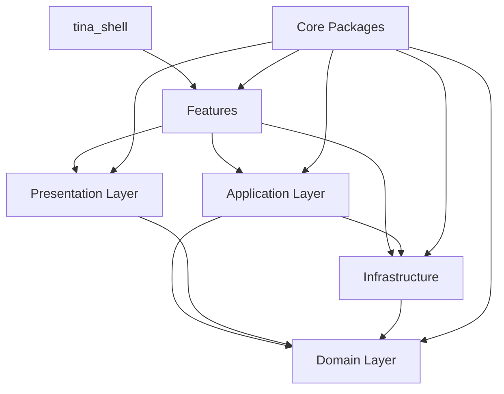
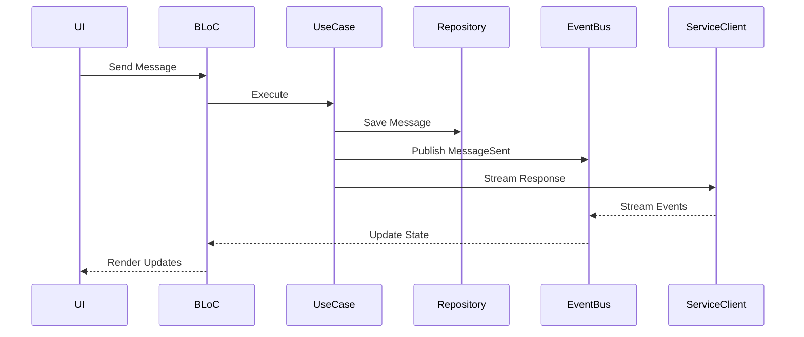

# Tina AI Assistant - Monorepo Architecture Guide

## Executive Summary

This document synthesizes insights from 8 different architectural analyses to define the optimal monorepo structure for the Tina AI Assistant project. After comprehensive evaluation, we recommend a **Hybrid Architecture** that combines the best aspects of Clean Architecture, Domain-Driven Design, and Hexagonal Architecture, organized in a layered-modular structure with plugin capabilities.

**Important Note**: Tina AI Assistant is a **client-only Flutter application** that connects to external AI services (OpenAI, Anthropic, etc.) and workflow platforms (n8n, Flowise, etc.). This architecture does NOT involve building a traditional backend server - it's about managing connections and configurations for external service providers.

## Architecture Overview

### Core Principles
1. **Domain-Centric Design**: Business logic at the center, independent of frameworks
2. **Port & Adapter Pattern**: Clear interfaces between core and external systems
3. **Layered Modularity**: Horizontal technical layers with vertical feature modules
4. **Plugin Extensibility**: Support for third-party extensions and customizations
5. **Event-Driven Communication**: Loose coupling between components via events

## Recommended Package Structure

```
tina/
├── apps/
│   ├── tina_shell/                  # Main Flutter application shell
│   └── tina_desktop/                 # Desktop-specific wrapper (future)
│
├── packages/
│   ├── core/                        # Shared utilities and infrastructure
│   │   ├── tina_core/               # Common types, constants, extensions
│   │   ├── tina_contracts/          # Shared interfaces and protocols
│   │   ├── tina_events/             # Event bus and domain events
│   │   ├── tina_logging/            # Structured logging infrastructure
│   │   └── tina_testing/            # Test utilities and mocks
│   │
│   ├── domain/                      # Business logic (pure Dart, no Flutter)
│   │   ├── chat_domain/             # Chat entities, value objects, aggregates
│   │   ├── service_providers_domain/ # External service provider management logic
│   │   ├── tool_domain/             # Tool entities and execution logic
│   │   ├── workflow_domain/         # Workflow entities and orchestration
│   │   └── security_domain/         # Credentials, permissions, policies
│   │
│   ├── application/                 # Use cases and application services
│   │   ├── chat_application/        # Chat-related use cases
│   │   ├── service_providers_application/ # Service provider management use cases
│   │   ├── tool_application/        # Tool execution use cases
│   │   ├── workflow_application/    # Workflow orchestration use cases
│   │   └── security_application/    # Authentication/authorization use cases
│   │
│   ├── infrastructure/              # External system integrations
│   │   ├── database/                # Drift database implementation
│   │   │   ├── tina_database/       # Core database with FTS5
│   │   │   └── tina_migrations/     # Database migration management
│   │   │
│   │   ├── providers/               # AI provider implementations
│   │   │   ├── openai_provider/     # OpenAI API integration
│   │   │   ├── anthropic_provider/  # Anthropic Claude integration
│   │   │   ├── gemini_provider/     # Google Gemini integration
│   │   │   └── openrouter_provider/ # OpenRouter integration
│   │   │
│   │   ├── orchestrators/           # Workflow orchestrator clients
│   │   │   ├── n8n_client/          # n8n integration with SSE
│   │   │   ├── flowise_client/      # Flowise integration
│   │   │   └── sim_studio_client/   # Sim Studio integration
│   │   │
│   │   ├── integrations/            # External service integrations
│   │   │   ├── mcp_client/          # MCP server JSON-RPC client
│   │   │   ├── storage_service/     # Secure storage implementation
│   │   │   └── notification_service/# System notifications
│   │   │
│   │   └── network/                 # Network layer
│   │       ├── http_client/         # Dio HTTP client configuration
│   │       ├── sse_client/          # Server-sent events client
│   │       └── websocket_client/    # WebSocket client (future)
│   │
│   ├── presentation/                # Shared UI components and utilities
│   │   ├── design_system/           # Widgetbook design system
│   │   │   ├── tokens/              # Design tokens (colors, spacing)
│   │   │   ├── components/          # Reusable UI components
│   │   │   └── themes/              # Theme configurations
│   │   │
│   │   ├── routing/                 # go_router configuration
│   │   ├── state/                   # Shared state management (Bloc/Riverpod)
│   │   └── widgets/                 # Common Flutter widgets
│   │
│   └── features/                    # Feature-specific implementations
│       ├── chat/                    # Chat feature module
│       │   ├── ui/                  # Chat screens and widgets
│       │   ├── bloc/                # Chat state management
│       │   └── adapters/            # Chat-specific adapters
│       │
│       ├── service_configuration/   # External service configuration feature
│       │   ├── ui/                  # Service configuration screens
│       │   ├── bloc/                # Service configuration state management
│       │   └── adapters/            # Service provider adapters
│       │
│       ├── tool_execution/          # Tool execution feature
│       │   ├── ui/                  # Tool UI components
│       │   ├── bloc/                # Tool state management
│       │   └── adapters/            # Tool-specific adapters
│       │
│       └── workflow_designer/       # Workflow design feature
│           ├── ui/                  # Workflow designer UI
│           ├── bloc/                # Workflow state management
│           └── adapters/            # Workflow-specific adapters
│
├── plugins/                         # Optional plugin packages
│   ├── example_tool_plugin/        # Example tool plugin
│   └── example_theme_plugin/       # Example theme plugin
│
└── tools/                           # Development tools
    ├── mason_bricks/                # Mason templates
    ├── code_generation/             # Code generation scripts
    └── scripts/                     # Build and deployment scripts
```

## Package Dependencies

### Dependency Rules
1. **Domain packages** have NO external dependencies (pure Dart)
2. **Application packages** depend only on domain packages
3. **Infrastructure packages** depend on domain and external libraries
4. **Feature packages** can depend on all layers but not on each other
5. **Core packages** can be used by any package

### Dependency Flow
```
Features → Application → Domain ← Infrastructure
    ↓           ↓          ↓           ↓
    └───────────── Core ────────────────┘
```

## Package Specifications

### Core Packages

#### `tina_core`
**Purpose**: Shared utilities, constants, and base classes
**Dependencies**: None (pure Dart)
**Key Components**:
- Result type for error handling
- Common exceptions and failures
- Extension methods
- Constants and enums
- Base use case interface

#### `tina_contracts`
**Purpose**: Shared interfaces and contracts
**Dependencies**: `tina_core`
**Key Components**:
- Port interfaces (primary and secondary)
- Event contracts
- Stream event definitions
- Plugin interfaces
- Service contracts

#### `tina_events`
**Purpose**: Event-driven architecture support
**Dependencies**: `rxdart`, `tina_core`
**Key Components**:
- Event bus implementation
- Domain event base classes
- Event aggregator
- Event replay mechanisms
- Event sourcing support

### Domain Packages

#### `chat_domain`
**Purpose**: Chat business logic and entities
**Dependencies**: None (pure Dart)
**Key Components**:
- Chat aggregate root
- Message entities and value objects
- Chat repository interface
- Business rules and invariants
- Domain events (MessageSent, ChatCreated, etc.)

#### `service_providers_domain`
**Purpose**: External service provider management domain logic
**Dependencies**: None (pure Dart)
**Key Components**:
- ExternalServiceClient entity and value objects
- Service provider types (LLM, Orchestrator, MCP)
- Configuration value objects
- Service provider repository interface
- Service provider capability definitions

#### `tool_domain`
**Purpose**: Tool execution domain logic
**Dependencies**: None (pure Dart)
**Key Components**:
- Tool entity and metadata
- Tool execution context
- Permission value objects
- Tool repository interface
- Tool discovery interface

### Infrastructure Packages

#### `tina_database`
**Purpose**: Drift database implementation with FTS5
**Dependencies**: `drift`, `sqlite3_flutter_libs`, domain packages
**Key Components**:
- Database schema definition
- DAO implementations
- Repository implementations
- Migration management
- Full-text search implementation

#### Provider Packages (OpenAI, Anthropic, etc.)
**Purpose**: AI provider integrations
**Dependencies**: `dio`, `flutter_client_sse`, domain packages
**Key Components**:
- Provider-specific API clients
- Streaming response handlers
- Model configuration
- Error handling and retry logic
- Token counting utilities

### Feature Packages

#### `chat` Feature
**Purpose**: Complete chat functionality
**Dependencies**: All layers, `bloc`, `go_router`
**Key Components**:
- Chat list screen
- Conversation screen
- Message input widget
- Streaming message display
- Chat BLoC/Cubit
- Feature-specific adapters

## Technology Stack

### Core Dependencies
```yaml
dependencies:
  # State Management
  flutter_bloc: ^8.1.3
  flutter_riverpod: ^2.4.9
  
  # Database
  drift: ^2.14.1
  sqlite3_flutter_libs: ^0.5.15
  
  # Networking
  dio: ^5.3.3
  retrofit: ^4.0.3
  flutter_client_sse: ^2.0.0
  json_rpc_2: ^3.0.2
  
  # Code Generation
  freezed_annotation: ^2.4.1
  json_annotation: ^4.8.1
  
  # Routing
  go_router: ^12.1.3
  
  # UI/Design System
  widgetbook: ^3.7.0
  flutter_gen: ^5.3.2
  
  # Security
  flutter_secure_storage: ^9.0.0
  
  # Utilities
  rxdart: ^0.27.7
  envied: ^0.5.2
  get_it: ^7.6.4
  injectable: ^2.3.2
  
dev_dependencies:
  # Code Generation
  build_runner: ^2.4.7
  freezed: ^2.4.6
  json_serializable: ^6.7.1
  drift_dev: ^2.14.1
  retrofit_generator: ^8.0.6
  
  # Testing
  flutter_test:
  mocktail: ^1.0.1
  bloc_test: ^9.1.5
  
  # Linting
  very_good_analysis: ^5.1.0
  
  # Development Tools
  mason: ^0.1.0-dev.51
  melos: ^3.4.0
```

## Implementation Patterns

### 1. Repository Pattern
```dart
// Domain layer - interface
abstract class ChatRepository {
  Future<Result<Chat>> getChat(ChatId id);
  Future<Result<List<Chat>>> getAllChats();
  Future<Result<Chat>> createChat(CreateChatParams params);
  Future<Result<Unit>> deleteChat(ChatId id);
}

// Infrastructure layer - implementation
class DriftChatRepository implements ChatRepository {
  final TinaDatabase _database;
  
  @override
  Future<Result<Chat>> getChat(ChatId id) async {
    try {
      final data = await _database.chatDao.findById(id.value);
      return Success(ChatMapper.toDomain(data));
    } catch (e) {
      return Failure(DatabaseFailure(e.toString()));
    }
  }
}
```

### 2. Use Case Pattern
```dart
class SendMessageUseCase {
  final ChatRepository _chatRepository;
  final ExternalServiceClient _serviceClient;
  final EventBus _eventBus;
  
  Future<Result<Message>> execute(SendMessageParams params) async {
    // Validate input
    final validationResult = params.validate();
    if (validationResult.isFailure) return validationResult;
    
    // Get chat
    final chatResult = await _chatRepository.getChat(params.chatId);
    if (chatResult.isFailure) return chatResult.mapFailure();
    
    // Create and save message
    final message = Message.create(
      chatId: params.chatId,
      content: params.content,
      role: MessageRole.user,
    );
    
    // Publish event
    await _eventBus.publish(MessageSentEvent(message));
    
    // Get AI response from external service (streaming)
    await _serviceClient.streamResponse(message);
    
    return Success(message);
  }
}
```

### 3. BLoC Pattern
```dart
class ChatBloc extends Bloc<ChatEvent, ChatState> {
  final SendMessageUseCase _sendMessageUseCase;
  final GetChatHistoryUseCase _getChatHistoryUseCase;
  
  ChatBloc({
    required SendMessageUseCase sendMessageUseCase,
    required GetChatHistoryUseCase getChatHistoryUseCase,
  }) : _sendMessageUseCase = sendMessageUseCase,
       _getChatHistoryUseCase = getChatHistoryUseCase,
       super(ChatInitial()) {
    on<SendMessage>(_onSendMessage);
    on<LoadChatHistory>(_onLoadChatHistory);
  }
  
  Future<void> _onSendMessage(
    SendMessage event,
    Emitter<ChatState> emit,
  ) async {
    emit(ChatSending());
    
    final result = await _sendMessageUseCase.execute(
      SendMessageParams(
        chatId: event.chatId,
        content: event.content,
      ),
    );
    
    result.fold(
      (failure) => emit(ChatError(failure.message)),
      (message) => emit(ChatMessageSent(message)),
    );
  }
}
```

### 4. Adapter Pattern
```dart
// Port definition
abstract class AIServicePort {
  Future<Result<StreamController<String>>> streamCompletion(
    ServiceProviderId serviceProviderId,
    List<Message> messages,
  );
}

// Adapter implementation
class OpenAIAdapter implements AIServicePort {
  final OpenAIClient _client;
  
  @override
  Future<Result<StreamController<String>>> streamCompletion(
    ServiceProviderId serviceProviderId,
    List<Message> messages,
  ) async {
    try {
      final controller = StreamController<String>();
      
      _client.streamChat(
        messages: messages.map((m) => m.toOpenAIFormat()).toList(),
        onData: (chunk) => controller.add(chunk),
        onDone: () => controller.close(),
        onError: (error) => controller.addError(error),
      );
      
      return Success(controller);
    } catch (e) {
      return Failure(AIServiceFailure(e.toString()));
    }
  }
}
```

## Development Workflow

### 1. Package Creation
```bash
# Create a new domain package
melos exec --scope="tina_*" -- flutter create --template=package .

# Generate package structure
mason make package_template \
  --name=new_domain \
  --type=domain \
  --output=packages/domain/
```

### 2. Code Generation
```bash
# Run build_runner for all packages
melos run build

# Watch mode for development
melos run watch

# Generate for specific package
melos exec --scope="chat_domain" -- flutter pub run build_runner build
```

### 3. Testing Strategy
```bash
# Run all tests
melos run test

# Run tests with coverage
melos run coverage

# Run specific package tests
melos exec --scope="chat_domain" -- flutter test
```

## Migration Roadmap

### Phase 1: Foundation (Weeks 1-2)
1. Set up monorepo structure with Melos
2. Create core packages (tina_core, tina_contracts, tina_events)
3. Define domain entities and value objects
4. Set up CI/CD pipeline

### Phase 2: Domain & Application (Weeks 3-4)
1. Implement domain packages (chat, service_providers, tool, workflow, security)
2. Create application layer use cases
3. Define repository interfaces
4. Set up event bus and domain events

### Phase 3: Infrastructure (Weeks 5-6)
1. Implement database package with Drift
2. Create AI provider adapters (OpenAI, Anthropic)
3. Build orchestrator clients (n8n, Flowise)
4. Implement MCP client

### Phase 4: Features (Weeks 7-8)
1. Migrate existing UI to feature packages
2. Implement BLoC state management
3. Connect features to application layer
4. Set up routing with go_router

### Phase 5: Polish & Optimization (Weeks 9-10)
1. Implement Widgetbook design system
2. Add comprehensive testing
3. Performance optimization
4. Documentation and examples

## Best Practices

### 1. Dependency Management
- Use `melos` for monorepo management
- Keep dependencies minimal and focused
- Version packages independently
- Use dependency overrides sparingly

### 2. Code Organization
- One class per file (except related small classes)
- Group related functionality in subdirectories
- Use barrel exports for clean imports
- Keep feature packages self-contained

### 3. Testing
- Unit test domain logic thoroughly (>90% coverage)
- Integration test feature flows
- Use mocks for external dependencies
- Test-driven development for complex logic

### 4. Documentation
- Document all public APIs
- Include examples in package README
- Maintain architecture decision records (ADRs)
- Keep dependency diagrams updated

### 5. Code Quality
- Use `very_good_analysis` linting rules
- Enforce formatting with `dart format`
- Regular refactoring sessions
- Code reviews for all changes

## Performance Considerations

### 1. Build Performance
- Use `melos` caching for faster builds
- Selective package building
- Parallel test execution
- Incremental code generation

### 2. Runtime Performance
- Lazy loading of features
- Efficient state management
- Database indexing and FTS5
- Stream processing optimization

### 3. Bundle Size
- Tree shaking for unused code
- Conditional imports for platform-specific code
- Lazy loading of heavy dependencies
- Code splitting for web deployment

## Security Guidelines

### 1. Credential Management
- Never commit API keys or secrets
- Use `flutter_secure_storage` for sensitive data
- Implement proper permission scoping
- Regular security audits

### 2. Data Protection
- Encrypt sensitive data at rest
- Use secure communication channels
- Implement proper authentication
- Follow OWASP guidelines

### 3. Plugin Security
- Sandbox plugin execution
- Validate plugin inputs
- Review third-party plugins
- Implement permission system

## Conclusion

This monorepo architecture provides a scalable, maintainable foundation for the Tina AI Assistant that:

1. **Supports Team Collaboration**: Clear package boundaries enable parallel development
2. **Ensures Code Quality**: Separation of concerns and comprehensive testing
3. **Enables Extensibility**: Plugin architecture and clean interfaces
4. **Maintains Performance**: Optimized build and runtime characteristics
5. **Facilitates Open Source**: Clear structure for community contributions

The architecture balances complexity with pragmatism, providing structure without over-engineering. It positions Tina for growth while maintaining development velocity and code quality.

**Key Clarification**: This is a client-only architecture for managing connections to external AI services and workflow platforms. No traditional backend server is required - all "service provider" functionality refers to configuring and communicating with external APIs and services.

## Next Steps

1. **Review & Approval**: Review this architecture with stakeholders
2. **Tooling Setup**: Configure Melos and create package templates
3. **MVP Implementation**: Start with core packages and chat feature
4. **Iterative Development**: Build features incrementally
5. **Community Engagement**: Open source with clear contribution guidelines

## Appendices

### A. Package Dependency Graph


### B. Event Flow Diagram


### C. Testing Pyramid
```
         /\
        /  \  E2E Tests (5%)
       /____\
      /      \  Integration Tests (20%)
     /________\
    /          \  Widget Tests (25%)
   /____________\
  /              \  Unit Tests (50%)
 /________________\
```

### D. Technology Decision Matrix

| Aspect | Technology | Rationale |
|--------|------------|-----------|
| State Management | BLoC + Riverpod | BLoC for features, Riverpod for global state |
| Database | Drift + SQLite | Type-safe queries, FTS5 support |
| Networking | Dio + Retrofit | Interceptors, code generation |
| Code Generation | Freezed + JsonSerializable | Immutable models, JSON handling |
| Testing | Mocktail | Simple, powerful mocking |
| Routing | go_router | Declarative, type-safe routing |
| Design System | Widgetbook | Component documentation and testing |
| Monorepo | Melos | Flutter-specific tooling |
| Analysis | very_good_analysis | Industry-standard linting |

This architecture guide serves as the definitive reference for building and maintaining the Tina AI Assistant monorepo structure.